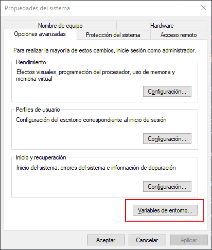
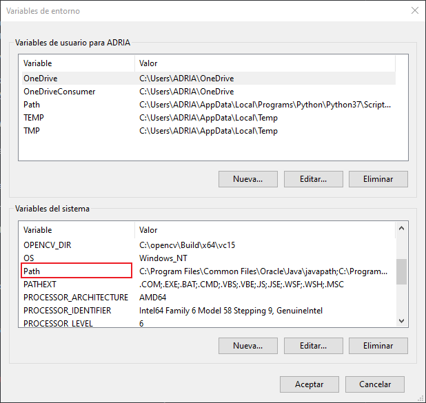
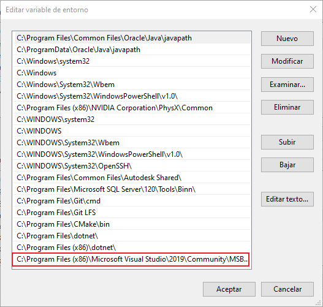

# HelloEngine

HelloEngine is a Game Engine made by videogame development students [Zhida Chen](https://github.com/Xidashuaige) & [Adrià Sellarés](https://github.com/AdriaSeSa).

This is a 3D game engine. The engine state is under development right now.

The goal is to create a complete game engine with Entity Component System, fast 3D rendering, resource manager, scripting language and other utilities.

# How to use

This Engine is only available for Windows 10. To correclty use the engine, you need Visual Studio 2019. Older versions may not work, and the engine hasn't been tested on newer versions. 

# How to enable Automatic Compilation:

(If you are reading this on the downloaded version, check our repository to see the README with images: https://github.com/HelloGamesCompany/HelloEngine/)

If Automatic compilation doesn't work, it means that a path to the MSBuild.exe is missing in your system environment variables. To enable this feature, you must be an administrator on your current account. If you are not an administrator, the automatic compilation cannot be enabled.

## 1: Find the current MSBuild.exe

* Go to you Microsoft Visual Studio installation directory for the x86 version (usually at C:\Program Files (x86)\Microsoft Visual Studio).

* Go to 2019\Community\MSBuild\Current\Bin

* Copy the path (should be similar to C:\Program Files (x86)\Microsoft Visual Studio\2019\Community\MSBuild\Current\Bin).

## 2: Add it to your PATH in your **system** environment variables.

* Open the "Edit System environment variables" window. On the Windows search bar, type "path" and open the first option.

* Click on Environment Variables, at the end of the opened window.

* At the bottom section, named System variables, find "Path" and double click on it.

* Scroll to the bottom of the opened window, to an empty space, and add the copied path on step #1.

## 3: Try if the "msbuild" command works correctly

* Open the command prompt (typing cmd in the windows search bar).

* Type "msbuild -version" and press Enter.

* If this displays your current version of MSBuild, the Automatic Compilation should work the next time you open the Engine. 

* If you are executing the engine from Visual Studio (you are a developer), make sure to close and open Visual Studio before executing again.

# Most important features to be reviewed

These are some additional features that are important to know about:

* Undo / Redo implementation.

HelloEngine allows to use Ctrl + Z and Ctrl + Y to Undo / Redo changes on ImGui Widgets. In this version, it only applies to Transform Component widgets inside Inspector.

* C++ Scripiting system

You can now create and use C++ scripts to add Behavior to any GameObject. From the scripts, you can access any game object in the scene, create new ones, and manipulate their components. For Information about how to use the Scripting system, check the SCRIPTING_INSTRUCTIONS.md file.

* Instance Rendering

Instance Rendering. To improve performance, HelloEngine uses Instance rendering to render every Mesh. It is not finished yet, but it can be noticable when instancing multiple meshes.

* Efficiency focused ECS

Efficience focused Entity Component System. An implementation of the ECS where the GameObjects do not use an Update method to iterate over every Component. Instead, every Component is linked to an object inside the Engine that is Updated by a corresponding manager. This way, constantly updating every object is not necessary and performance can be improved. In this version, there are major improvements to be done, but we will not implement them until we are concerned about performance in the future.

## How to use

While hovering the Scene Window:

* Right Click + WASD to move.
* Right Click + Mouse movement to look around.
* Alt + Left Click to orbitate around selected Game Object. If no game object is selected, orbitate around {0,0,0}.
* Mouse wheel to change scene camera zoom.
* Shift to move faster.

### Loading assets

Currently you can load FBX and PNG/DDS files. To do so, drag and drop the file you want to load into the engine. This will create a copy of the dragged file into the Assets folder. You can also drag it inside the file from the windows explorer. If a file doesnt appear, try minimize the engine and open it again.

Once the file is imported, drag and drop the file from the Project window inside the Engine. Drop inside Scene to load an FBX. Drop inside MaterialComponent Inspector image if it is a PNG/DDS image.

You can load separeted meshes from the model file by clicking on the model file in the projet window. This will show all meshes inside that model. This files can be dragged and dropped too.

# Current version

**Current state** : Basic Scripting. (v1.0):

Scripting system working.

Automatic compilation.

Hot Reload for scripting system.

Script creation.

Major bug fixing from Serialization, Camera, Entity Component and other systems.

### Versions

Early in development (v0.1)

3D rendering available, but no mesh loading yet.

Scene structure created, but no Entity component system yet.

Added XML utilities to load Int, Float, Bool and String variables from a default XML file. This system is called QuickSave and mimics the PlayerPrefs system form Unity Engine.

Geometry viewer: v0.2

**Basic Features**

3D rendering with FBX loading.

Texture diffuse rendering applied to any mesh. 

Entity Component System with Hierarchy. Allows change of parents and entities and components can be enabled/disabled.

Basic Project window to manage files inside Assets

Inspector window to manage component variables of selected entity.

Console to log information about the engine.

Transform component that uses child/parent relationship to apply transformations.

Drag & drop to Import files into Project folder. This can be then used to be applied to Entities.

Drag & drop of FBX files into the scene to load the Mesh.

Drag & drop of png files into a MaterialComponent inside Inspector to change the texture currently being used.

Viewing of memory consumption. 

Level Editor (v0.5):

**Basic Features**

Custom file format for Mesh and Model. Named "hmesh" and "hmodel".

Resource Manager that:

* Makes sure every asset gets loaded only once in memory, and unloads when no other references are using it.
* Creates Meta files beside assets to connect to the custom file format files inside Resources.
* Destroys any Resources data that no longer has an Asset.

Scene Serialization. Now scenes can be saved and loaded into an "HScene" file. 

Camera Component added Orthographic camera. Updated camera component variables to be changed inside inspector.

Project window with icons and correct form.

Project window allows drag and drop of all usable assets (mesh, texture, model and scene).

Start/Stop/Pause/Next frame buttons that control an internal timer. This can be seen inside Configuration Window!

All objects can be culled using the main camera's frustum culling option. 

Main camera can be switched between multiple game cameras.

Added ImGuizmo to manage game objects transform inside the Scene.

Undo/Redo can be applied to multiple actions:

* Move with ImGuizmo
* Parent game objects
* Delete game objects

Mouse picking of game objects inside the scene using Raycast method.

Scene camera panning using middle mouse button.

